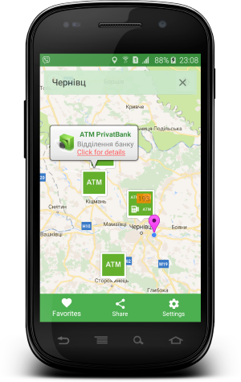
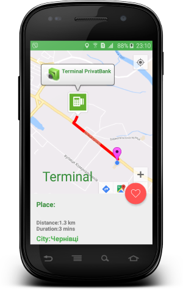
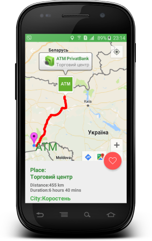
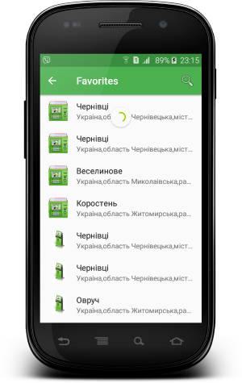

# ATM & Terminals PrivatBank

  

Junior Android developer entrance test

#### Task:
* Using the API PrivatBank need to get information about ATMs and self-service terminals relative to the specified location.
* Display all information on the card.
* By clicking on the marker ATM or terminal output for more information.
* It is possible to get routes.
* From the definition of location on GPS.
* To realize the possibility of the program without the Internet.

#### Search

To find the ATM and self-service terminal, enter the address of a comma-separated. (City, street, etc.)

#### Detail info

#### Route

#### Favorites list

All data are loaded from the server are stored in a SQLite database and are available without internet.

#### Used libraries:
* com.squareup.picasso:picasso:2.5.2
* com.squareup.retrofit2:retrofit:2.1.0
* com.squareup.retrofit2:converter-gson:2.1.0
* com.google.android.gms:play-services-maps:10.0.1
* com.google.android.gms:play-services-location:10.0.1
* com.squareup.okhttp3:logging-interceptor:3.3.1
* com.google.maps.android:android-maps-utils:0.4.+

Developed By
-------
Igor Havrylyuk (Graviton57)

[1]: https://github.com/graviton57/privatbank.git
