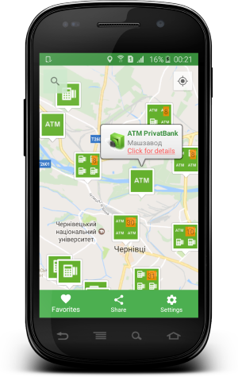

# ATM & Terminals PrivatBank

  

#### Where is Acquiring Assistant?
Simple Android app that can help you to find PrivatBank ATM's and Self-service terminals.
You can:
  - Search for ATM's and Self-service terminals: to find the ATM and self-service terminal, enter the address of a comma-separated. (City, street, etc.)
  - Check details of the device (place, timetable)
  - All data are loaded from the server are stored in a SQLite database and are available without internet.
  - You can build a route to any device using Google Maps app
  - Manage your favorite list (search, remove)
  - Manage application settings

All ATM and Terminals|Search | Detail info
-------------|----------------- | -------------
  |  | 

Route|Favorites list | Settings
-------------|----------------- | -------------
  |  | 

#### Used libraries:
* com.squareup.picasso:picasso:2.5.2
* com.squareup.retrofit2:retrofit:2.1.0
* com.squareup.retrofit2:converter-gson:2.1.0
* com.google.android.gms:play-services-maps:10.0.1
* com.google.android.gms:play-services-location:10.0.1
* com.squareup.okhttp3:logging-interceptor:3.3.1
* com.google.maps.android:android-maps-utils:0.4.+

Developed By
-------
Igor Havrylyuk (Graviton57)

[1]: https://github.com/graviton57/privatbank.git
